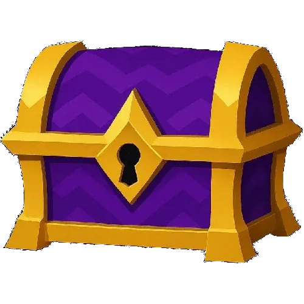

#  Arcane Chest

An in-chat mini-app for ArcaneChat that allows to wrap content
(called "gem") inside a locked chest, only people with access to the
key code can unlock the chest and access the gem 💎✨

## Contributing

### Installing Dependencies

After cloning this repo, install dependencies:

```
pnpm i
```

### Checking code format

```
pnpm check
```

### Testing the app in the browser

To test your work in your browser (with hot reloading!) while developing:

```
pnpm start
```

### Building

To package the WebXDC file:

```
pnpm build
```

To package the WebXDC with developer tools inside to debug in Delta Chat, set the `NODE_ENV`
environment variable to "debug":

```
NODE_ENV=debug pnpm build
```

The resulting optimized `.xdc` file is saved in `dist-xdc/` folder.
